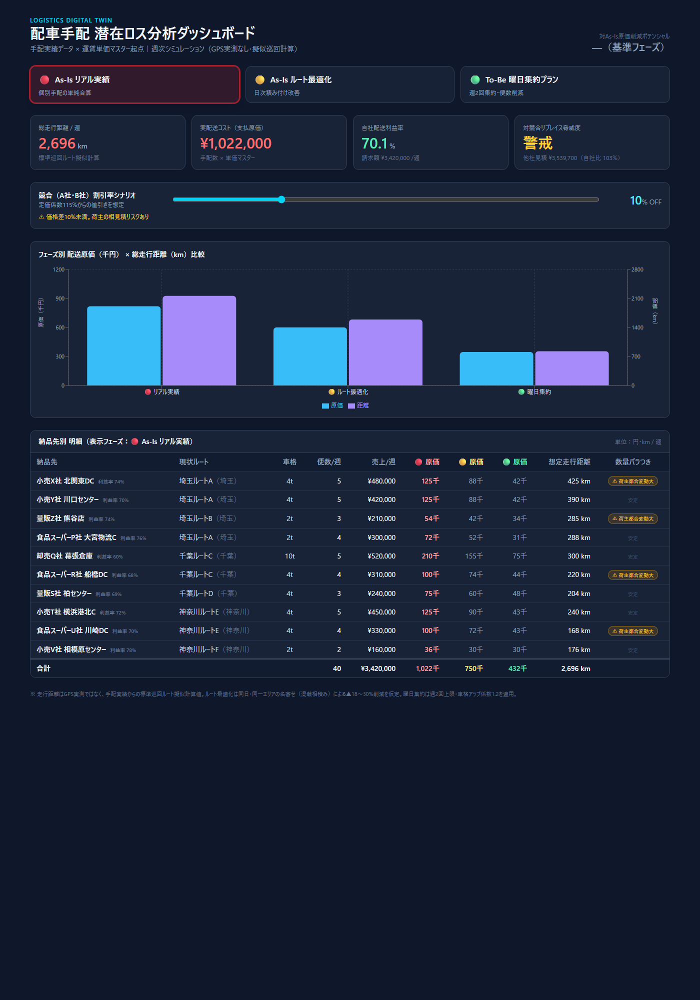

# 配車手配 潜在ロス分析ダッシュボード（logistics-dispatch-dashboard）

同じ配送データを使って、「今のやり方」と「配送をまとめて効率化した場合」で運賃がどれだけ変わるかを見比べられるデモです。

## これは何を確認できるツールか

配送先ごとに個別に車を手配していると、車の空きスペースや便数に無駄が出ていることがあります。このツールは同じ配送実績データに対して3つの段階でシミュレーションし、どこまで削減できるかを一目で示します。

1. 🔴 **今のやり方** — 依頼ごとに個別で車を手配した場合の運賃（現状）
2. 🟡 **積み合わせた場合** — 同じ日・近いエリアの配送をまとめて1台に積んだ場合の運賃
3. 🟢 **曜日をまとめた場合** — 配送する曜日を週2回に絞り、そのぶん便数自体を減らした場合の運賃（車のサイズアップ分も加味）

あわせて、大手宅配便を使った場合の想定金額とも比較し、自社便がどれだけ価格競争力を持てているかも確認できます。

## 画面イメージ



## 触ってみる

```bash
npm install
npm run dev
```

ブラウザで `http://localhost:5173/logistics-dispatch-dashboard/` を開くと表示されます。

本番ビルドの確認:

```bash
npm run build
npm run preview
```

## デモ

https://logtk.github.io/logistics-dispatch-dashboard/

## データについて

- 画面内のデータ（納品先・手配実績・金額など）は**すべてダミーデータ**です。実在の企業・取引・金額とは一切関係ありません。
- 走行距離はGPSの実測値ではなく、配送実績から推定した目安の距離です。

## 使っている技術

[Vite](https://vite.dev/) + [React](https://react.dev/) / [Tailwind CSS](https://tailwindcss.com/) / [Recharts](https://recharts.org/)
